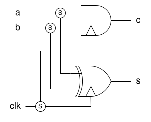

# Getting Started with RustSFQ

This section walks you through a simple example that demonstrates the basic syntax and core functionality of the **RustSFQ** library.

We’ll build a half-adder circuit and export it as a SPICE netlist.

---

## Example: Half Adder in RustSFQ

The following Rust program defines a half-adder circuit and generates a corresponding SPICE-format netlist.  
We’ll review each part step-by-step below.

```rust
use rust_sfq::*;

fn half_adder() -> Circuit<3, 0, 2, 0> {
    let (mut circuit, [a, b, clk], [], [c_out, s_out], []) =
        Circuit::create(["a", "b", "clk"], [], ["c", "s"], [], "HalfAdder");

    let (a1, a2) = circuit.split(a);
    let (b1, b2) = circuit.split(b);
    let (clk1, clk2) = circuit.split(clk);

    let c = circuit.and_p(a1, b1, clk1);
    let s = circuit.xor_p(a2, b2, clk2);

    circuit.unify(c, c_out);
    circuit.unify(s, s_out);

    return circuit;
}

fn main() {
    let ha = half_adder();
    design![&ha].print(RsfqlibSpice);
}
```

<div align="center">
  
</div>

## Project Setup and Import

```rust
use rust_sfq::*;
```

Start by importing all items from the `rust_sfq` crate. This gives you access to the main types like `Circuit`, `Wire`, and backend generators such as `RsfqlibSpice`.

## Creating a New Circuit

```rust
let (mut circuit, [a, b, clk], [], [c_out, s_out], []) =
    Circuit::create(["a", "b", "clk"], [], ["c", "s"], [], "HalfAdder");
```

This call to `Circuit::create()` initializes a new circuit with:

- **Inputs**: `a`, `b`, `clk`
- **Outputs**: `c`, `s`
- **Name**: `"HalfAdder"`

The second and fourth arguments (empty arrays) represent **CounterInputs** and **CounterOutputs**, which are unused in this example.

The returned values include:

- a mutable `Circuit` object
- `Wire` objects for the inputs
- `CounterWire` objects for outputs

## Splitting Wires for Fan-Out

```rust
let (a1, a2) = circuit.split(a);
let (b1, b2) = circuit.split(b);
let (clk1, clk2) = circuit.split(clk);
```

`Circuit` object has `split()` function, which takes one `Wire` object and returns two `Wire` objects.

By calling this function, a SPLIT gate is added to the circuit.

## Labeling Wires

```rust
let c = circuit.and_p(a1, b1, clk1).label("c", &mut circuit);
```

You can manually assign a label to any wire, which will appear in the generated netlist.
If you don’t provide a label, a unique name will be automatically assigned.

## Creating Gates

```rust
let c = circuit.and_p(a1, b1, clk1);
let s = circuit.xor_p(a2, b2, clk2);
```

Logic gates such as `AND` and `XOR` are created by calling methods on the `Circuit` object.  
In this example:

- `and_p()` creates a carry gate
- `xor_p()` creates a sum gate

The `_p` suffix means the gate is pipelined. It is shorthand for calling the ordered form with `a % 1`, `b % 1`, and `clk % 0`.

## Connecting to Circuit Outputs

```rust
circuit.unify(c, c_out);
circuit.unify(s, s_out);
```

To complete the circuit, connect each gate’s output to the corresponding circuit output using `unify()`.

## Exporting the Circuit

```rust
fn half_adder() -> Circuit<3, 0, 2, 0> {
    ...
    return circuit;
}
fn main() {
    let ha = half_adder();
    design![&ha].print(RsfqlibSpice);
}
```

The `half_adder()` function returns a fully constructed `Circuit` object.  
This object is parameterized by the number of inputs, counter inputs, outputs, and counter outputs:  
`Circuit<3, 0, 2, 0>`.

The `design![&ha]` macro creates a `Design`, runs timing checks, and passes the checked circuit to the backend.
`print(RsfqlibSpice)` prints a SPICE-format netlist based on the RSFQlib.
You can use a different backend (e.g. `RsfqlibVerilog` or `LogicalVerilog`) to export in other formats.

---

## Running the Program

You can generate the SPICE netlist by compiling and running the program:

```sh
cargo run
```

This will print the netlist to standard output.

## Output: Example SPICE Netlist

Here is the SPICE netlist generated by the example:

```text
.subckt HalfAdder a b clk c s
XSPLIT1 a _SPLIT1_q1 _SPLIT1_q2 THmitll_SPLIT
XSPLIT2 b _SPLIT2_q1 _SPLIT2_q2 THmitll_SPLIT
XSPLIT3 clk _SPLIT3_q1 _SPLIT3_q2 THmitll_SPLIT
XAND4 _SPLIT1_q1 _SPLIT2_q1 _SPLIT3_q1 c THmitll_AND2
XXOR5 _SPLIT1_q2 _SPLIT2_q2 _SPLIT3_q2 s THmitll_XOR
.ends
```

- Each logic gate is named sequentially (e.g., `XAND4`, `XXOR5`)
- Wires starting with an underscore (e.g., `_SPLIT1_q1`) are automatically generated
- Labels like `c` and `s` appear as specified by the circuit outputs

---

## Summary

In this example, you learned how to:

- Create a new circuit using `Circuit::create()`
- Instantiate gates and label outputs
- Connect gate outputs to declared circuit outputs
- Export the circuit as a netlist
