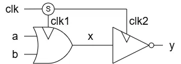
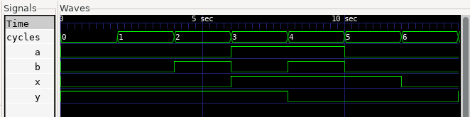
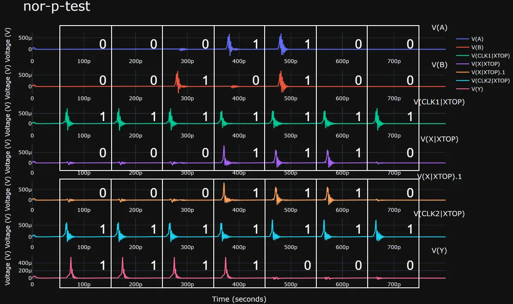
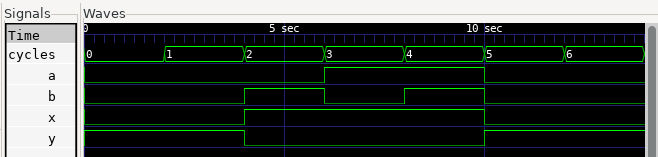
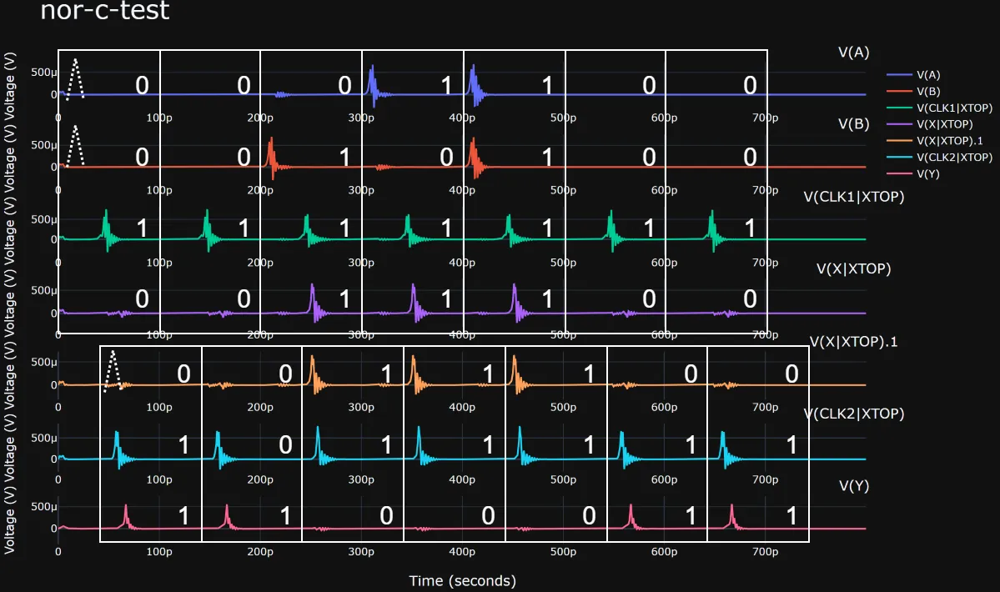
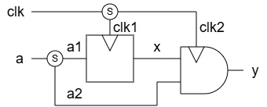
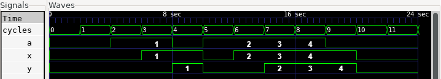
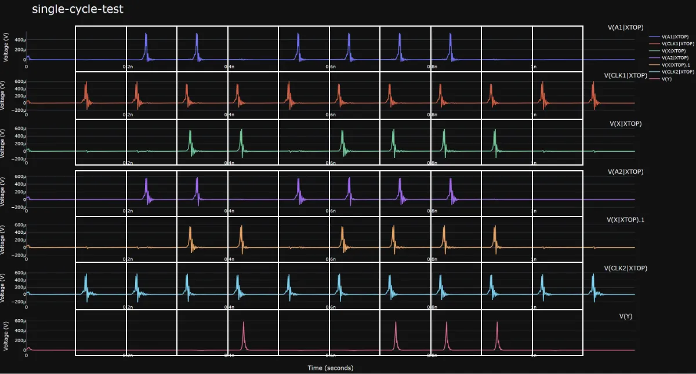
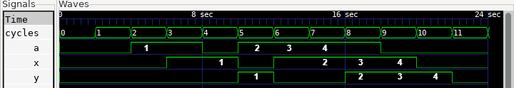
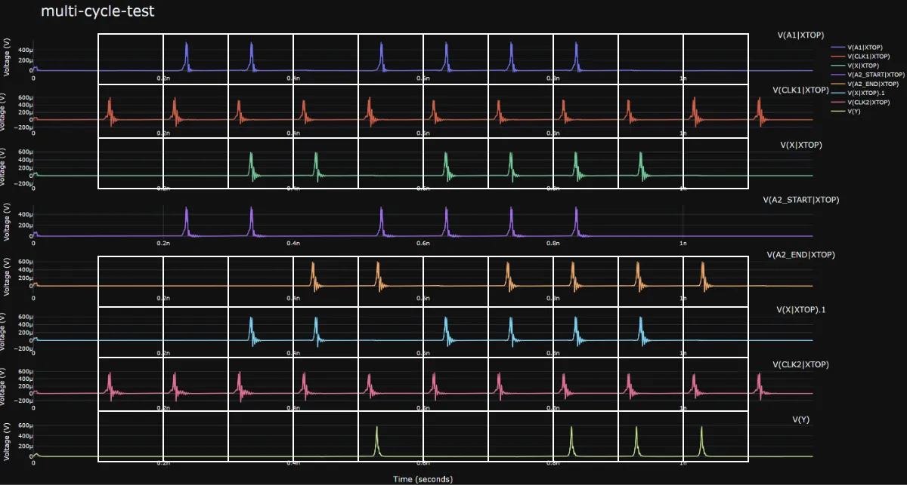

# Timing Model

## Overview

SFQ circuits usually operate as gate-level pipelines. However, by controlling the arrival order of data and clock pulses, the same gates can also be used in a combinational style.

RustSFQ uses an arrival-order-based timing model so that designers can describe the intended behavior of arbitrary SFQ circuits while still keeping this flexibility.
RustSFQ also provides a **cycle-level** simulation environment based on this timing model.

## Assumptions

RustSFQ models timing under the following assumptions:

- The whole circuit is driven by a single clock source with a fixed frequency.
- The start time of a cycle may differ from gate to gate. For each gate, a cycle is measured from the earliest pulse that can arrive at that gate.
- A logical value is represented by the presence or absence of a pulse. No pulse means `0`; one or more pulses mean `1`. In particular, two or more pulses are treated the same as one pulse.

## Example 1

The source code and simulation code for this example are available under `samples/timings`.

Consider the following circuit, which consists of an OR gate followed by a NOT gate.



### Pipelined Version

Because OR and NOT gates are clock-synchronous gates, they are commonly operated as a two-stage pipeline.
In RustSFQ, this can be written as follows:

```rust
fn nor_pipelined() -> Circuit<3, 0, 1, 0> {
    let inputs = ["a", "b", "clk"];
    let outputs = ["y"];
    let (mut ckt, [a, b, clk], [], [y_out], []) =
        Circuit::create(inputs, [], outputs, [], "NorPipelined");

    let (clk1, clk2) = ckt.split(clk);
    ckt.label(&clk1, "clk1");
    // pipelined
    let x = ckt.or(a % 1, b % 1, clk1 % 0).label("x", &mut ckt);

    ckt.label(&clk2, "clk2");
    // pipelined
    let y = ckt.not(x % 1, clk2 % 0);

    ckt.unify(y, y_out);

    return ckt;
}
```

Both the `or` and `not` gates specify that the clock pulse arrives before the data input pulses.
The `%` operator attaches an arrival-order number to each input.
Only the relative order matters; these numbers are not physical delay values.

Run the cycle-level logical simulation with:

```shell
cd samples/timings/logical
cargo run logical > modules.v
iverilog -g2012 -s top -I ../../../lib/logical/ nor-p-test.sv
./a.out
gtkwave nor-p-test.vcd
```

The simulation result is shown below.
The intermediate signal `x = a | b` is delayed by one cycle from `a` and `b`, and the output `y = ~x` is delayed by one more cycle.



Next, run the analog simulation with:

```shell
cd samples/timings/spice
cargo run spice > modules.cir
josim-cli -o nor-p-test.csv nor-p-test.cir
python josim-plot2.py nor-p-test.csv -t stacked
```

The result is:



The top four traces show the inputs and output of the OR gate, and the bottom three traces show the input and output of the NOT gate.
The white boxes indicate the cycle boundaries for each gate.

The start time of each gate-local cycle is determined by the first pulse that can arrive at that gate.
In this example, both gates use the clock signal as the reference, which matches the description `let x = ckt.or(a % 1, b % 1, clk1 % 0)`.

The `0` and `1` labels in the figure indicate whether a pulse is present in that cycle.
These values match the cycle-level logical simulation above.

### Combinational Version

If the clock arrives after the data within a cycle, the gate behaves like part of a combinational circuit.

This behavior can be described in RustSFQ as follows:

```rust
fn nor_combinational() -> Circuit<3, 0, 1, 0> {
    let inputs = ["a", "b", "clk"];
    let outputs = ["y"];
    let (mut ckt, [a, b, clk], [], [y_out], []) =
        Circuit::create(inputs, [], outputs, [], "NorCombinational");

    let (clk1, clk2) = ckt.split(clk);
    ckt.label(&clk1, "clk1");
    // combinational
    let x = ckt.or(a % 0, b % 0, clk1 % 1).label("x", &mut ckt);

    ckt.label(&clk2, "clk2");
    // combinational
    let y = ckt.not(x % 0, clk2 % 1);

    ckt.unify(y, y_out);

    return ckt;
}
```

The only difference from the pipelined version is the timing specified on the OR and NOT gates.
In terms of connectivity, both descriptions still correspond to the same circuit schematic.

The cycle-level logical simulation gives the following result, confirming that the circuit operates combinationally.



Now consider the corresponding analog simulation.
Timing specifications in RustSFQ describe the intended behavior of the circuit.
They **do not, by themselves, guarantee** that the physical circuit satisfies those timing constraints.

For that reason, BUFF gates are inserted on the clock path below to adjust the delay.

```rust
fn nor_combinational() -> Circuit<3, 0, 1, 0> {
    let inputs = ["a", "b", "clk"];
    let outputs = ["y"];
    let (mut ckt, [a, b, clk], [], [y_out], []) =
        Circuit::create(inputs, [], outputs, [], "NorCombinational");

    let (clk1, clk2) = ckt.split(clk);
    ckt.label(&clk1, "clk1");
    let x = ckt.or(a % 0, b % 0, clk1 % 1).label("x", &mut ckt);

    // delays for analog simulation
    let clk2 = ckt.buff(clk2);
    let clk2 = ckt.buff(clk2);
    ckt.label(&clk2, "clk2");
    let y = ckt.not(x % 0, clk2 % 1);

    ckt.unify(y, y_out);

    return ckt;
}
```

The analog simulation result is:



Cycle start positions differ by gate and are based on the earliest time at which an input signal can arrive at each gate.
In the first cycle of this example, there are no pulses on `A`, `B`, or `X`, but dashed lines mark where those pulses will appear if they are present.

The `0` and `1` labels in this simulation result match the earlier cycle-level logical simulation.

## Example 2: Single-Cycle and Multi-Cycle Paths

The examples in this section compare a single-cycle path with a multi-cycle version of the same data path.
Both circuits split the input `a` into two branches.
One branch is captured by a DFF to produce `x`; the other branch is used as the second input of an AND gate.



### Single-Cycle Path

In the single-cycle version, the second branch, `a2`, has no explicit cycle delay.
It is consumed by the pipelined AND gate in the usual way.
The `_p` helpers describe the ordinary pipelined arrival order: the clock arrives before each data input.

```rust
fn single_cycle_path() -> Circuit<2, 0, 1, 0> {
    let inputs = ["a", "clk"];
    let outputs = ["y"];
    let (mut ckt, [a, clk], [], [y_out], []) =
        Circuit::create(inputs, [], outputs, [], "SingleCyclePath");

    let (a1, a2) = ckt.split(a);
    ckt.label(&a1, "a1");
    ckt.label(&a2, "a2");

    let (clk1, clk2) = ckt.split(clk);
    ckt.label(&clk1, "clk1");
    let x = ckt.dff_p(a1, clk1);
    ckt.label(&x, "x");

    ckt.label(&clk2, "clk2");
    let y = ckt.and_p(x, a2, clk2);
    let y = ckt.jtl(y);

    ckt.unify(y, y_out);

    ckt
}
```

The cycle-level logical simulation shows the values of `a`, `x`, and `y` for the single-cycle path.
The numbers in the waveform identify the input values associated with each cycle in which the AND output is `1`.



The corresponding analog simulation shows the pulse waveforms at the input, DFF output, bypass path, clock branches, and output.



### Multi-Cycle Path

The multi-cycle version delays the `a2` branch by two additional cycles before it reaches the same AND gate.
For example, this can model a very long interconnect whose signal propagation takes a substantial amount of time.

```rust
fn multi_cycle_path() -> Circuit<2, 0, 1, 0> {
    let inputs = ["a", "clk"];
    let outputs = ["y"];
    let (mut ckt, [a, clk], [], [y_out], []) =
        Circuit::create(inputs, [], outputs, [], "MultiCyclePath");

    let (a1, a2) = ckt.split(a);
    ckt.label(&a1, "a1");

    // Physical delay for analog simulation.
    let mut a2 = a2;
    ckt.label(&a2, "a2_start");
    for _ in 0..32 {
        a2 = ckt.buff(a2);
    }
    ckt.label(&a2, "a2_end");

    // Cycle delay for logical simulation.
    ckt.add_delay(&a2, 2);

    let (clk1, clk2) = ckt.split(clk);
    ckt.label(&clk1, "clk1");
    let x = ckt.dff_p(a1, clk1);
    let x = ckt.buff(x);
    let x = ckt.buff(x);
    ckt.label(&x, "x");

    ckt.label(&clk2, "clk2");
    let y = ckt.and_p(x, a2, clk2);
    let y = ckt.jtl(y);

    ckt.unify(y, y_out);

    ckt
}
```

`add_delay(&a2, 2)` describes a two-cycle delay in RustSFQ's timing model.
The cycle-level logical backend represents it with two additional registers.

The BUFF chain is separate from the timing constraint. It supplies an actual physical delay for analog simulation, where the `a2_start` and `a2_end` labels make the delayed path easy to inspect.
Timing annotations state the intended cycle-level behavior; physical buffers are still needed to make the analog circuit satisfy that intent.

The logical simulation therefore differs from the single-cycle case.
For each output pulse on `y`, the corresponding value of `a` is from three cycles earlier: one cycle of pipelining plus the two additional cycles.



The analog waveform confirms that the BUFF chain delays the `a2` path from `a2_start` to `a2_end` before it reaches the AND gate.


